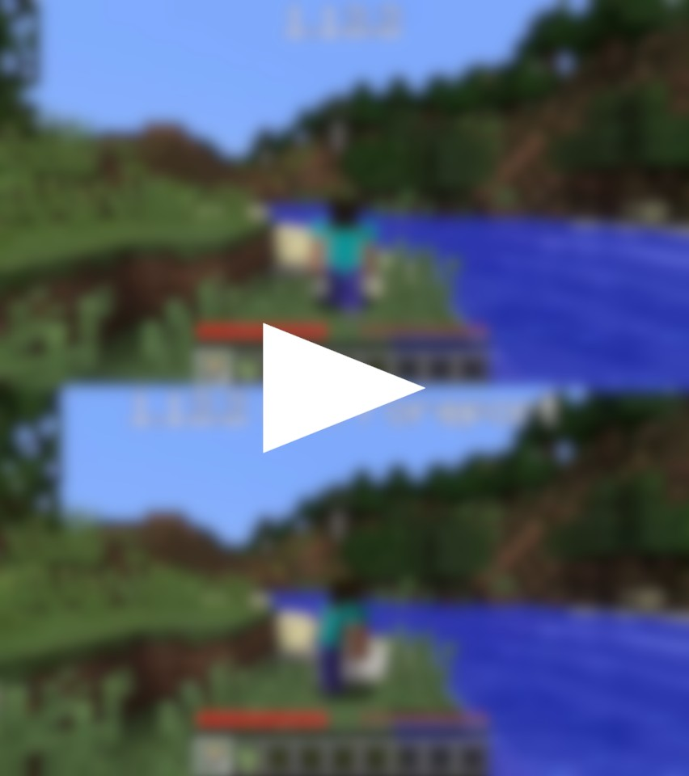

	
	 
	<b><i>For the old isn't all the good, but the new isn't all the better</i></b>

# Preamble
Once upon a time, long before the year 2012 became a thing, after two long years of development, **Minecraft 1.0.0** has been released. Those of us for whom the stream worked, and those lucky to have personally attended MINECON 2011, have watched Markus "Notch" Persson pull the release lever. That release marked the point of no return, shaping the path that Minecraft would follow for years. Many changes to the game's mechanics were since made, and none crucial. They all felt like updates, and [few complained](http://www.nerdragecomic.com/strips/2011-10-21.jpg), only to be [mocked by others](https://twitter.com/jeb_/status/421564096019189760). Nobody had thought of changing the game's logo, adding more notifications than there were already, or worse yet noticeably modifying the way Steve moved... Until Minecraft 1.12.

And so people have [complained](https://www.reddit.com/r/Minecraft/comments/66s2px/in_17w16b_players_can_now_run_backwards_without/), [complained](https://www.reddit.com/r/Minecraft/comments/6vxg4a/please_let_players_disable_all_the_tutorial_stuff/), and [complained some more](https://www.reddit.com/r/feedthebeast/comments/72toja/jei_vs_112s_vanilla_recipe_guide/). Many of them refrained from using 1.12, and enjoyed the long time support provided by modders for the versions 1.11.2 and earlier. Yet, sooner than later, Minecraft 1.12.2 managed to have become the new 1.7.10, the Minecraft version with all the mods and servers, probably owing to the releases following it [being](https://bugs.mojang.com/browse/MC-121381) [even](https://bugs.mojang.com/browse/MC-132135) [worse](https://www.reddit.com/r/Minecraft/comments/adcpuf/its_really_a_shame_that_customized_world/). After some time, even the most dedicated modders have slowly begun phasing out the releases of their mods for the Minecraft versions older than 1.12.

That was when **Foreport** came about. After identifying the most annoying problems of Minecraft 1.12, we have conceived a mod to resolve them, once and for all. **And that very mod is now, right here, available to you.**

# Features
But wait, what does Foreport even change? The answer is simple - **it only changes back** and **it only changes what Minecraft broke**. Oh, you want the details?

* **The Minecraft versions 1.11.2 and earlier have made the player's body twist when they walk backwards.** Minecraft 1.12 removed that functionality, claiming that it was a bug, and **Foreport brings it back**.
* **Since Minecraft 1.12, sneaking slightly buries the player in the ground.** But Foreport fixes that, of course.
* **Minecraft 1.12 introduces a recipe book...**
* **...and these annoying things called _toasts_ to pop up every single time a recipe is acquired or the game assumes that you don't know how to walk.** None of that in Foreport!
* Last but not least, **Minecraft 1.12 introduces a new logo**. You know, the one with the **JAVA EDITION** inscription, to remind you that [this](https://gamepedia.cursecdn.com/minecraft_gamepedia/thumb/0/0a/Bedrock_1.12.0.png/1200px-Bedrock_1.12.0.png) is now the true Minecraft. **With Foreport it's not!**
* And if you actually **like** ~~and subscribe to~~ a change introduced in Minecraft 1.12 and reverted in Foreport, **it's all configurable**! Except the new logo. Those who like the new logo are a statistical error, and, more importantly, it's difficult to make a config option for it. If you are a statistical error, just remove `assets/minecraft/textures/gui/title/edition.png` from the mod's `jar` file.

# Screenshots
So you've been here all this time only to look at the screenshots? I might have some bad news for you... But here, have a trailer movie.

Can you make anything out of the movie? No? ...fine, let's be honest, we hardly can as well, however awesome or not be it. [Thankfully, we have actually uploaded very legible comparison snapshots!](https://www.curseforge.com/minecraft/mc-mods/foreport/screenshots)

# Installation
So you have finished reading about the features, inspected the trailer movie trying to spot the described differences, and further inspected the snapshots. Or you may have simply scrolled all the way down there, completely ignoring the data we threw at you, whatever. From now on, we will assume that you liked Foreport and want to install it.

Foreport can be downloaded from within [GitHub](https://github.com/newbthenewbd/Foreport/releases/latest) or [CurseForge](https://www.curseforge.com/minecraft/mc-mods/foreport). Simply choose the latest `jar` file, download it and put it into the `mods` directory, usually located under `%appdata%\.minecraft` on Windows, `~/.minecraft` on Linux, and `~/Library/Application Support/minecraft` on macOS.

Alternatively, you may use the Twitch Launcher or compatible to automatically install the mod.

# Credits
Many thanks to the community of [The Forge Project Discord Channel](https://discord.gg/UvedJ9m) for providing modding help whenever it is needed.

Thanks to all the uncountable communities that provide various sorts of server space for the mod or its advertisements. Except these of them which distribute malware instead of the mod. And these which always provide an ancient version. And **especially** these claiming that this mod supports a Minecraft version that it does not. Yeah, no thanks to those guys.

Ender pearls to Endy, The Friendly Enderman™ of Foreport. Eating that snack made Endy sick.

Special thanks to Jens Bergensten, the author of the law that was supposed to mock the ideas behind mods like this, and worked, until it didn't. Jens, if You happen to be reading this, the inclusion in these credits was Your penance for allowing what Foreport reverts to happen in the first place.

Last but not least, the most special thanks go to [this great friend of mine](https://github.com/Buttpants) for the original inspiration behind the mod, increasing my motivation to code it by challenging my belief that it can be done, as well as the immense help with testing it in various environments.

# Nagging for Donations
> **Like the mod and sleep on mone?  
> Give me some, and feel awesome!***

**\*** We realize that few of us actually do sleep on mone. We don't either! Because of this, an alternative way to donate to the Foreport project is to donate your precious time by spreading the word. Tell all your malcontent friends about Foreport, explain to the content ones as to why vanilla 1.12 has it worse, bundle Foreport with all your modpacks, install it on your school computers, you name it! For extra awesomeness, tell us about it, too!\*\*

**\*\*** While we don't offer any perks for donating, all the aforementioned actions will increase our self-awesomeness too!

# Random Disclaimers
NOT AN OFFICIAL MINECRAFT PRODUCT. NOT APPROVED BY OR ASSOCIATED WITH MOJANG.  
"MINECRAFT" is a registered trademark and brand of Mojang Synergies AB.
